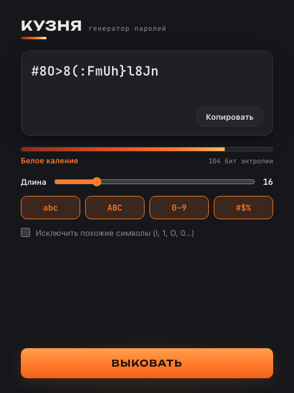
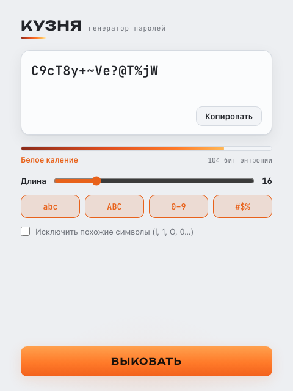

<div align="center">


# Кузня

**Настольный генератор паролей** — пароль выковывается из символов криптостойким RNG.

[](LICENSE)
[](https://github.com/Denchikper/password_generator/actions/workflows/build.yml)


</div>

Компактная утилита в метафоре кузницы: символы «проковываются» на экране,
а надёжность пароля показана как нагрев металла — от «холодного» до «белого
каления». Раньше это был скрипт на PyQt5; версия 2.0 полностью переписана на
**Tauri v2** — лёгкий нативный бинарь под macOS и Windows, генерация пароля
выполняется на Rust криптостойким RNG операционной системы.

## Скриншоты

<table>
  <tr>
    <td width="50%"></td>
    <td width="50%"></td>
  </tr>
  <tr>
    <td align="center"><sub>Тёмная тема — графит и жар</sub></td>
    <td align="center"><sub>Светлая тема — холодная сталь</sub></td>
  </tr>
</table>

## Возможности

- **Криптостойкая генерация.** Пароль собирается на Rust из `OsRng` — без
  modulo bias, с гарантией хотя бы одного символа из каждого выбранного набора.
- **Шкала нагрева.** Индикатор надёжности — энтропия в битах, переведённая в
  стадии ковки: «Холодный металл → Прогрев → Ковка → Белое каление».
- **Гибкие наборы.** Строчные, заглавные, цифры, символы; длина 4–64;
  режим «исключить похожие» убирает l/1/I/O/0/S/5/B/8.
- **Анимация проковки.** Символы перебираются и застывают слева направо
  (уважает `prefers-reduced-motion`).
- **Копирование в один клик** с подтверждением «Скопировано».
- **Темы оформления.** Светлая и тёмная — автоматически по системной теме.
- **Офлайн.** Шрифты вшиты в приложение, сеть не используется вовсе.

## Как это работает

Фронтенд отправляет параметры в Rust-команду `generate_password`: та собирает
пул символов, берёт по одному из каждого включённого набора, добирает остаток
равномерно из общего алфавита и перемешивает результат — всё на `OsRng`.
Энтропия считается как `длина × log₂(размер алфавита)` и отображается шкалой
нагрева. Вне окна Tauri генерация подменяется на `crypto.getRandomValues`,
поэтому дизайн можно смотреть в обычном браузере.

## Технологии

| Слой | Стек |
|------|------|
| Оболочка | [Tauri v2](https://v2.tauri.app/) (Rust) |
| Бэкенд | Rust — генерация пароля (`OsRng`), юнит-тесты |
| Фронтенд | React 18 + TypeScript + Vite |
| Стили | Нативный CSS с дизайн-токенами, тёмная тема |
| Шрифты | Unbounded + JetBrains Mono (вшиты, офлайн) |
| CI | GitHub Actions — сборка macOS (universal) и Windows, релиз по тегу |

## Установка

Готовые сборки — на странице [релизов](https://github.com/Denchikper/password_generator/releases):
`.dmg` для macOS (universal — Intel и Apple Silicon) и `.exe`/`.msi` для Windows.

## Сборка из исходников

Нужны [Node.js](https://nodejs.org/) 18+ и [Rust](https://rustup.rs/) (stable)
с [пререквизитами Tauri](https://v2.tauri.app/start/prerequisites/).

```bash
git clone https://github.com/Denchikper/password_generator.git
cd password_generator
npm install
npm run tauri build
```

Установщики появятся в `src-tauri/target/release/bundle/`.

## Разработка

```bash
npm run tauri dev    # приложение с hot-reload
```

Только для просмотра дизайна (без Rust и сборки) можно открыть фронтенд в браузере:

```bash
npm run dev          # http://localhost:1420
```

Тесты Rust-генератора:

```bash
cd src-tauri && cargo test
```

## Лицензия

[MIT](LICENSE) © Daniel Benovich

---

<div align="center"><sub>by <a href="https://github.com/Denchikper">Benovich</a></sub></div>
